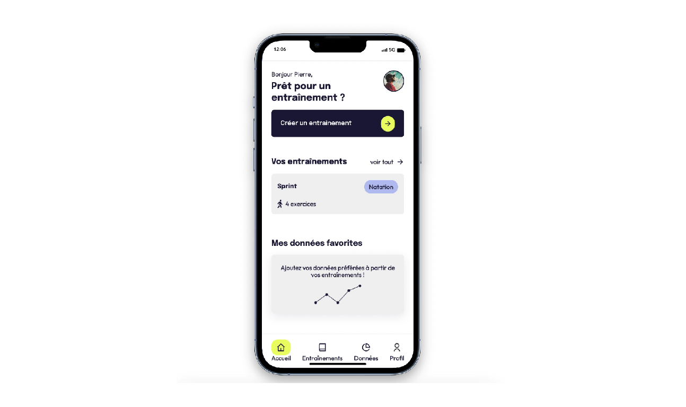

# Sportrack

Sportrack is a web application that allows you to track your sports performance in any sport. You can add personalized data and obtain statistics on its performance over time.
We can obtain a history of our different sports sessions.

This project was developed by 3 people over 2 weeks as part of my web developer training at Le Wagon school. My participation in this project was as follows:
- development of part of the back-end and front-end.
- in charge of putting into production on Heroku and resolving any problems.

The application was uniquely designed to be mobile responsive. To test the web application, it is recommended to use the Chrome extension: https://www.webmobilefirst.com/

## Installation and Run

The web application was developed with the Ruby On rails framework.
```
$ git clone https://github.com/carolinhng/sportrack.git
$ cd sportrack
$ bundle
$ rails db:create
$ rails db:migrate
$ rails db:seed
$ rails s
```
## Demo
Watch our demo on youtube.

[](https://youtu.be/YCqfJgcThgA)
